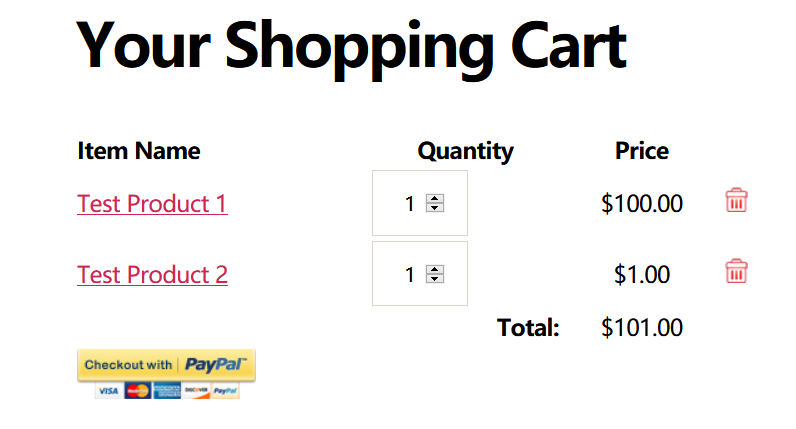
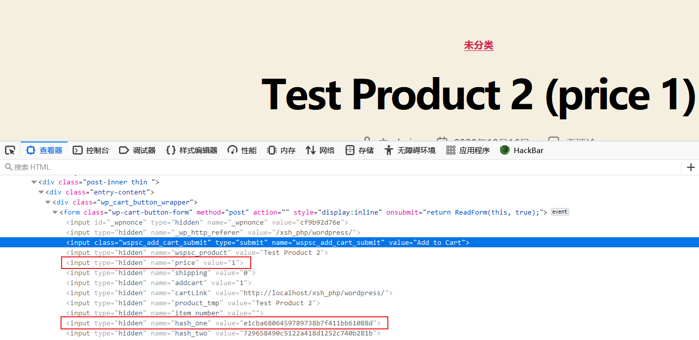
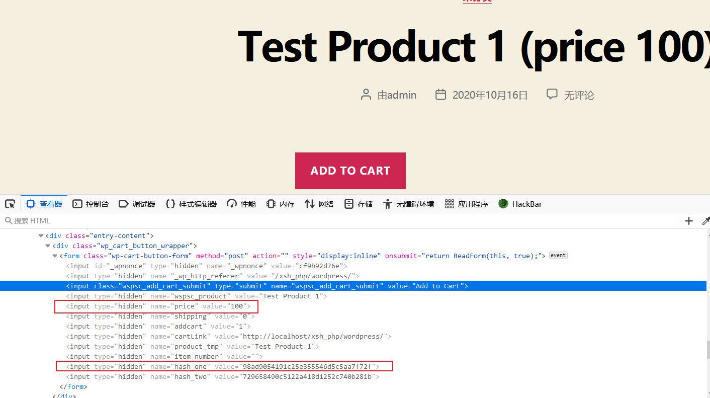
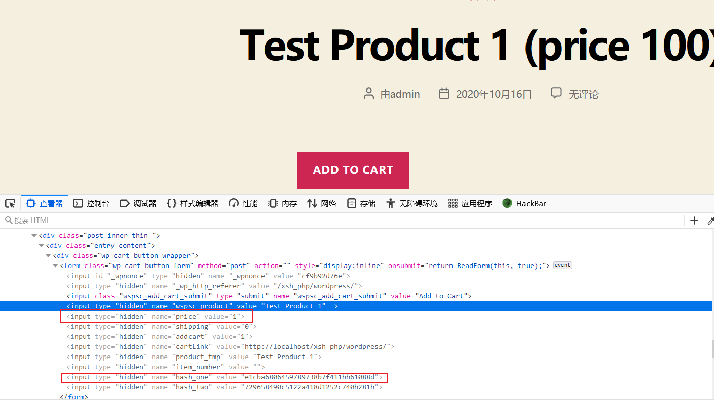
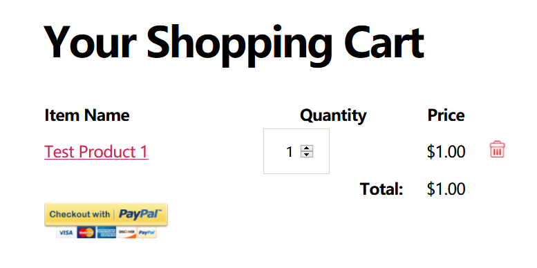
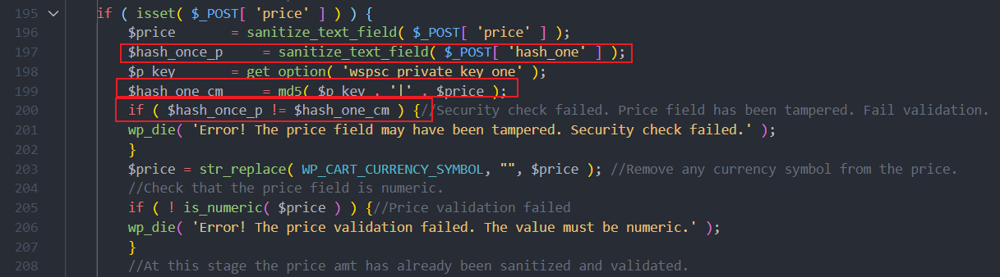

Hello, I find a vulnerability in the plugin, which can change the price of a commodity to the price of any existing commodity

For example, there are two products A (price 100) and B (price 1), I can change the price of the A to 1

Here is the recurrence of the vulnerability

Create two products `Test Product 1` and `Test product 2` with prices of 100 and 1

Audit the form of `Test product 2`, get it's params of `price` and `hash_one`

The source form of `Test Product 1`

Replace the value of the parameter of `price` and `hash_one` from `Test Product 2` to `Test Product 1`

Click the button `ADD TO CART` of `Test Product 1`, add `Test Product 1` with price of 1 (original price of 100) into shopping cart

The vulnerability appears in `wp_shopping_cart.php`

The `$hash_one_cm` created by `md5($p_key . '|' . $price)`, then compare with `hash_one`

Because `$p_key` is static, so if `hash_one` and `price` are corresponding, I can change the price of product

Corresponding `hash_one` and `price` I can get by exist product

So I can change the price of product to the lowest price of product

My suggestion is change `$hash_one_cm = md5( $p_key . '|' . $price );` to `$hash_one_cm = md5( $p_key . '|' . $price . '|' . $post_wspsc_product);` , bind the price and product